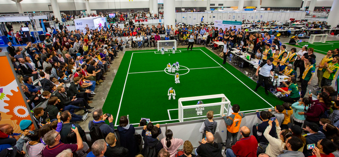

Background
##########

Robotics competitions tend to start off with rapid innovation, but after a couple of years, development seems to "slow down".
One reason for this is the way research output is shared.

**Teams aren't publishing research output in a form that can be directly used outside their
domain.**

Software written by teams aren't being reused much between different:

* Teams
* Soccer leagues
* Robotic projects

Publishing code in a way that can be transferred to a different domain is a whole challenge in
itself, (which robotics competitions often do not tackle very well).
With limited team resources, winning is usually a higher priority over code-sharing.

This results in teams reinventing the wheel all the time,
and many new teams and smaller teams spend so much time on that,
that they don't have time to focus on the research aspect.

To address this concern several open source ROS2 libraries are being developed to encourage code
reuse. The work is not conducted as part of a team, but by a separate organization called
ROS Sports, such that focus can be shifted away from winning, to the advancement of
robotic competitions and robotics in general.

ROS Sports is an organization that aims to develop and maintain high-quality open source solutions
for the trivial parts of robot sports code, such that such competitions can keep advancing.

.. _RoboCup: https://www.robocup.org/
