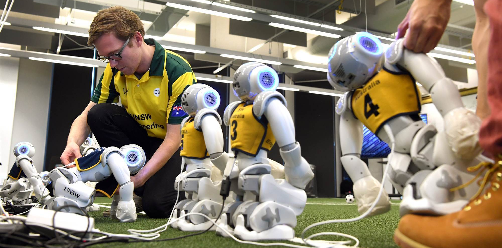

Contributing
############

ROS Sports is community-maintained, where most maintainers are volunteers.
**Please respect the maintainers who dedicate their time to improving robotics**.

If you share the same :ref:`vision` as ROS Sports and would like to contribute to ROS Sports,
here are some guidelines!

Follow the ROS Contributing Guide
*********************************

**We don't like reinventing the wheel!** The ROS community has established a well-defined
`Contributing Guide`_ that you should follow when contributing.

Pull Requests / Issues
**********************

Github PRs and Issues are the primary way to contact maintainers about bugs, feature requests and
contributions.

.. tip::

  When creating an issue, please consider proposing a fix to reduce load on maintainers, and even
  better, creating a PR with a fix.

Contributing to Documentation
*****************************

Adding and fixing existing documentation is a great way to contribute to ROS Sports. If you decide
to modify documentation, please raise a PR against the project's documentation repository.

If you have created learning aids, such as a blog post or a video tutorial, we would love to add
links to it! Please raise an issue against the relating project with a link.

Hosting a project on ROS Sports
*******************************

If you would like an existing project to be hosted on ROS Sports, please contact the
`organization owner`_ with a link to your repository for it to be discussed.

**Transferring a repository to ROS Sports does not transfer maintenance responsibility.**
A maintainer team will be created for the new project, which you will be added to as the primary
maintainer.

.. note::

  If a project does not align with the organization's vision, we will not host the project.

  If you have an idea for a project but have not implemented it yet, consider developing it in your
  Github account, before requesting to be hosted by ROS Sports.

.. warning::

  Stale repositories with lack of maintenance will be removed from the organization with notice.

Maintainer Guide
****************

Maintainer Teams
================

Projects and corresponding documentation are maintained by ROS Sports maintainer teams.
If you have made major contributions to a project, existing maintainers may reach out to you
to request becoming a maintainer.

.. note::

  Please do not contact the organization about becoming a maintainer of an existing project,
  unless the repository you are willing to maintain is currently unmaintained.

Writing Documentation
=====================

At ROS Sports, we encourage descriptive user documentation. User documentation should include
installation instructions, a description of the package, and examples of how to use the package.
Videos, diagrams and figures are encouraged.

ROS Sports doesn't have a strict guideline on how to write documentation, but for existing projects:

* **README.md** is used for small libraries that don't require much documentation.
  Your documentation will be part of your codebase repository.
* **ReadTheDocs** is used if your library plans on having more than one page of documentation.
  Your documentation will be maintained in a separate repository from your codebase. If you plan
  on including images and figures, this is the recommended method to prevent your codebase
  repository blowing up in size.

.. tip::

  If you plan on having multiple pages or including images/figures in your documentation, keep your
  documentation separate from your codebase.

  Switching from README.md to ReadTheDocs isn't straight forward since they use different languages
  (Markdown vs reStructuredText).

Writing Tests
=============

You should write tests to verify behaviour of your code. For bug fixes, write a test that breaks the
existing code, and submit a fix in the same PR.

Copyright Notices
=================

ROS Sports will not own your project, in the way a company owns code written by their employees.
The copyright notice should appear with your name or your organization name.

Releasing into ROS ecosystem
============================

All projects hosted by ROS Sports have a goal of being `released into the ROS ecosystem`_.

.. _Contributing Guide: https://docs.ros.org/en/rolling/Contributing.html
.. _released into the ROS ecosystem: http://wiki.ros.org/bloom/Tutorials/FirstTimeRelease
.. _organization owner: kenjibrameld@gmail.com
