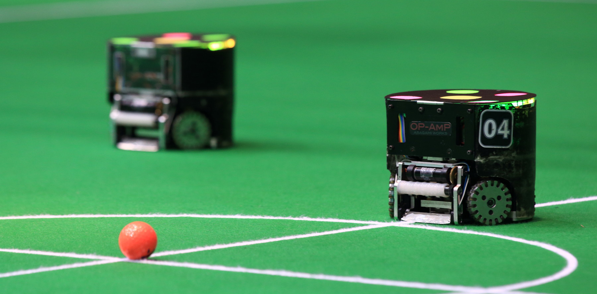

.. ROS Sports documentation master file, created by
   sphinx-quickstart on Wed Mar  2 22:13:42 2022.
   You can adapt this file completely to your liking, but it should at least
   contain the root `toctree` directive.

Welcome to ROS Sports!
======================

ROS Sports is an organization that **encourages open source collaboration in robotics sports**.
The organization develops and maintains a range of open source ROS libraries on `Github`_ and
works closely with teams that participate in robotics sports competitions.

We are setting up a `Discord Server`_, where we are building a ROS Sports community, come join!

.. toctree::
   :hidden:
   :maxdepth: 2

   background
   vision
   contributing
   collaborators
   project-list
   meetings
   contact

.. _Github: https://github.com/ros-sports
.. _Discord Server: https://discord.gg/bDEtcgQW
